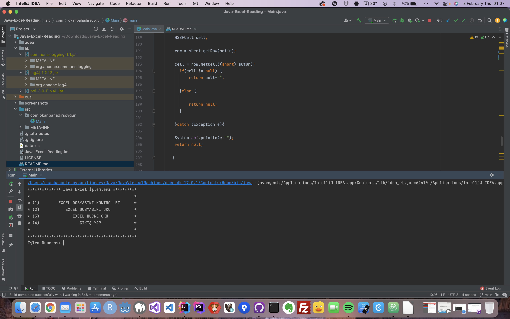

# Java Excel Transactions (en)

#### Console application that reads and creates excel (xls) file from excel with Java.

# Java Excel İşlemleri (tr)

#### Java ile excel(xls) verisi okuma, yaratma işlemi yapan konsol uygulaması.

### Screenshots

### Used Libraries

- Apache POI HSSF 3.0
- Apache Log4j 1.2.13
- Apache Commons Logging 1.1

### @developer by okan bahadır soygür (okanbahadirsoygur@gmail.com)

